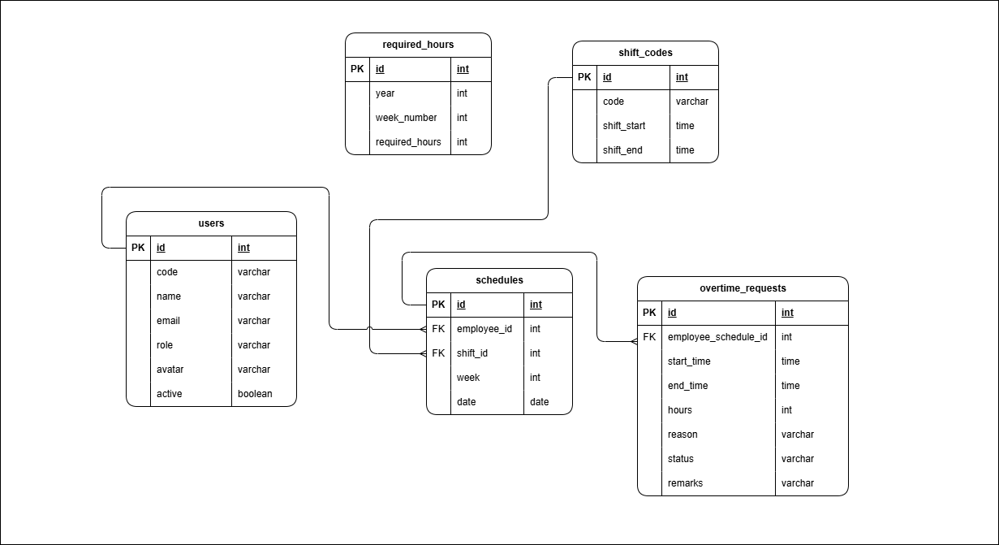

# 🕒 Overtime Tracker

A web-based system to help organizations **track, analyze, and manage employee overtime hours**.  
It provides a **digital filing workflow** for employees and approvers, as well as **analytics on overtime reasons**.

---

## Overview

This system allows:

-   Employees to **file overtime requests** with reasons and actual hours
-   Approvers to **approve**, **disapprove** (with remarks), or **mark as filed**

---

## Entity Relationship Diagram (ERD)



> _The ERD includes employees, shifts, schedules, overtime requests, and weekly hour rules._

---

## ⚙️ Tech Stack

-   **Backend:** [Laravel 11](https://laravel.com/) (API-based)
-   **Frontend:** [Vue 3](https://vuejs.org/) + [Inertia.js](https://inertiajs.com/) + TypeScript
-   **Database:** [MySQL](https://www.mysql.com/)
-   **Auth:** Laravel Auth (Sanctum/JWT-ready)
-   **Styling:** TailwindCSS + DaisyUI

---

## Getting Started

### 1. Clone the Repository

```bash
git clone https://github.com/your-username/overtime-tracker.git
cd overtime-tracker
```

### 2. Install Dependencies

```bash
# Backend
composer install

# Frontend
npm install
```

### 3. Setup Environment

1. Copy the example environment file:
    ```bash
    cp .env.example .env
    ```

2. Update .env with your database credentials and app URL.

3. Generate the Laravel App Key:

    ```bash
    php artisan key:generate
    ```

### 4. Run the Application

```bash
# Start Laravel backend
php artisan serve

# Start frontend (Vite)
npm run dev

```

### 5. Open in Browser

```bash
http://localhost:5173   # Vue only  
http://127.0.0.1:8000   # Laravel + Vue

```